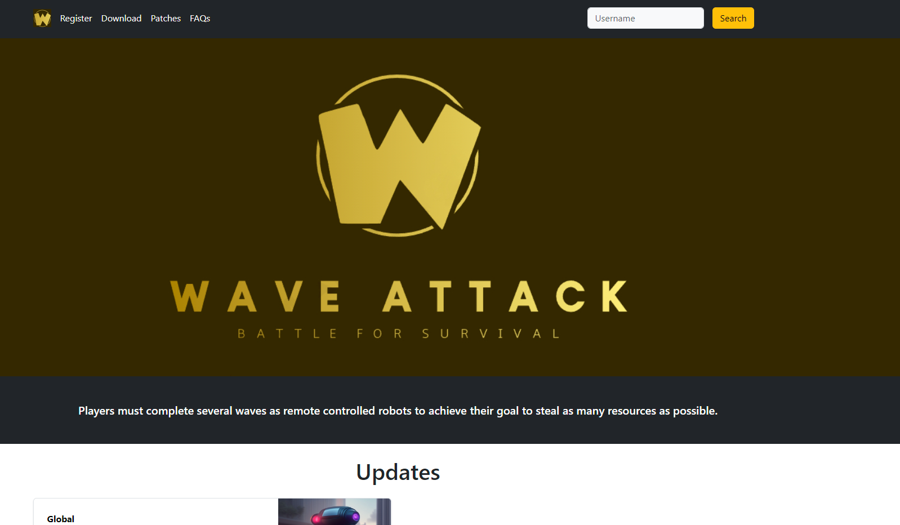
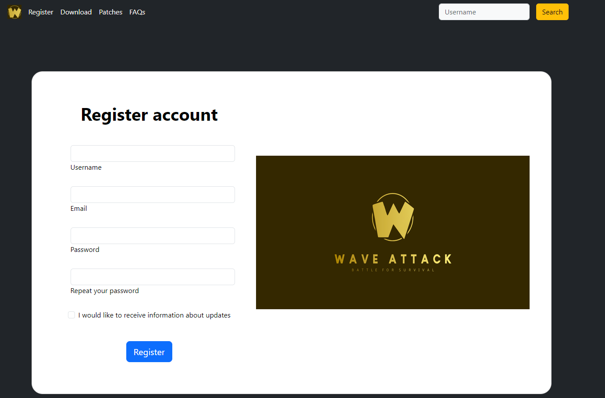
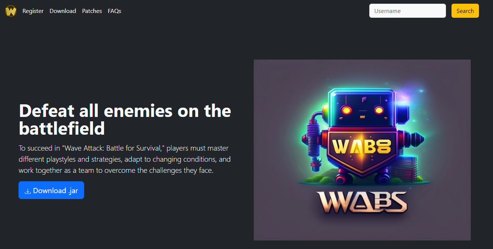
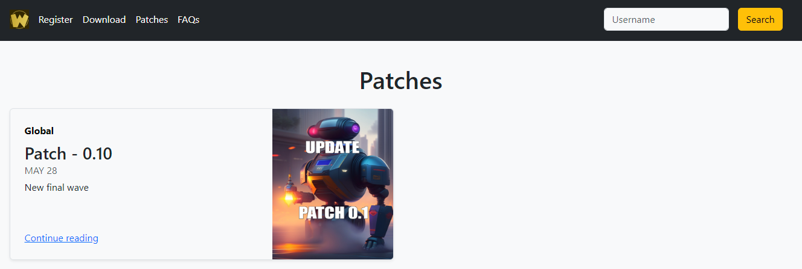
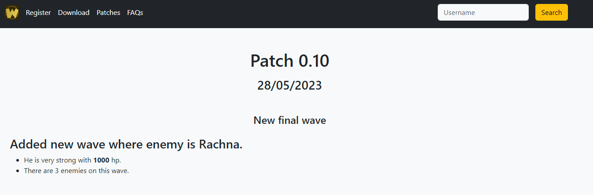
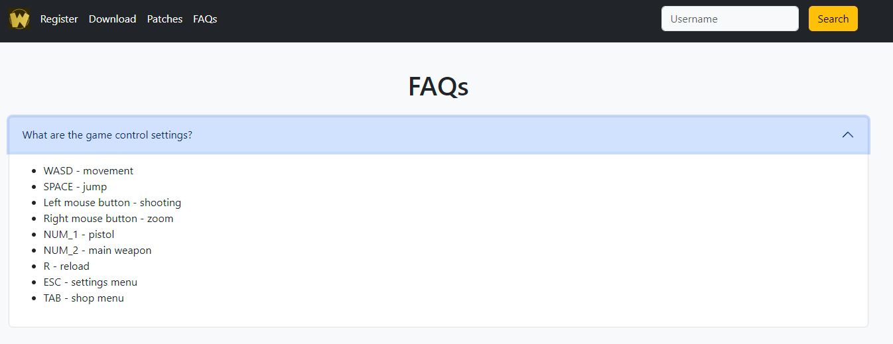
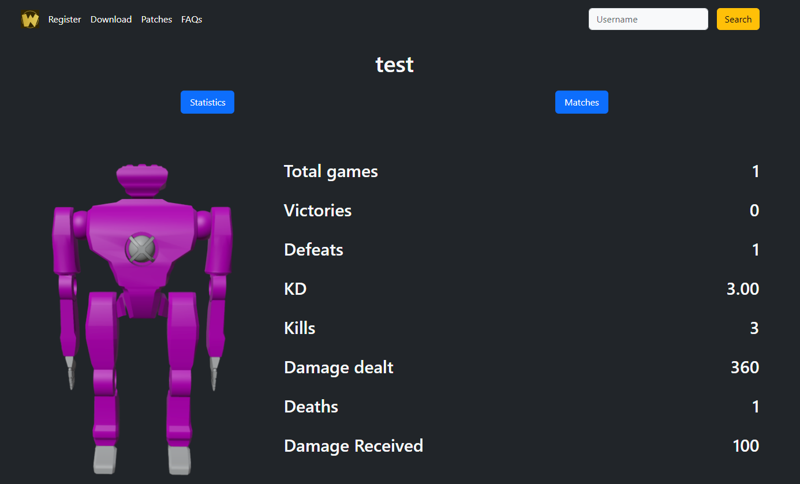
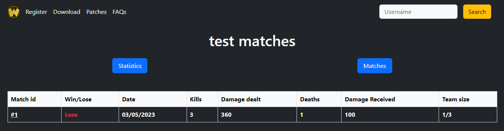
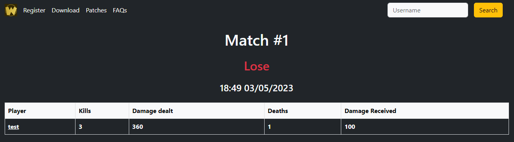
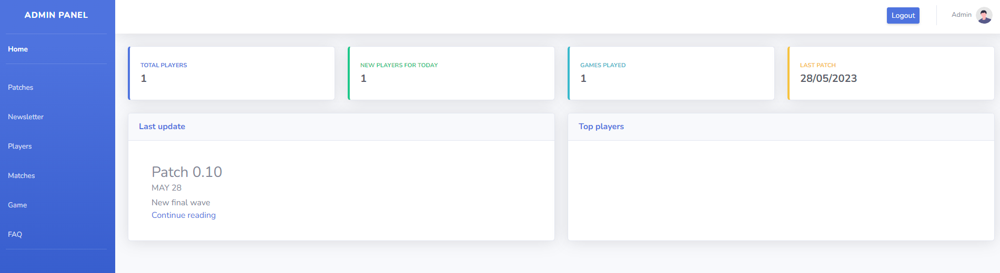

# Wave Attack Battle for Survival Website

Website for "Wave Attack Battle For Survival" game. Here you can create your account, track your game statistics and read updates.

When you enter the site, you are greeted by the **Main** page.

In the **Register** section you can register your account.

In the **Download** section you can download the latest version of the game.

In the **Patches** section, you can view all-time patches and their brief descriptions.

To see the **full description of the patch**, you can click Continue Reading.

In the **FAQs** section, you can see frequently asked questions about the mechanics in the game.

The most interesting thing is the **statistics tracking**. To view a player's stats, you need to type his **username** into the search field.

You can also watch his **matches** for all time by clicking on the matches button.

It is also possible to view all **information about the match**.

Also, we must not forget that site administrators need to constantly maintain the site and watch the statistics of the game.
This is what the **admin panel** is for.

In admin panel you can:

- add/delete/edit patches
- email everyone if there is any update
- view statistics about players
- view statistics about matches
- update the game file
- add/delete/edit new FAQs